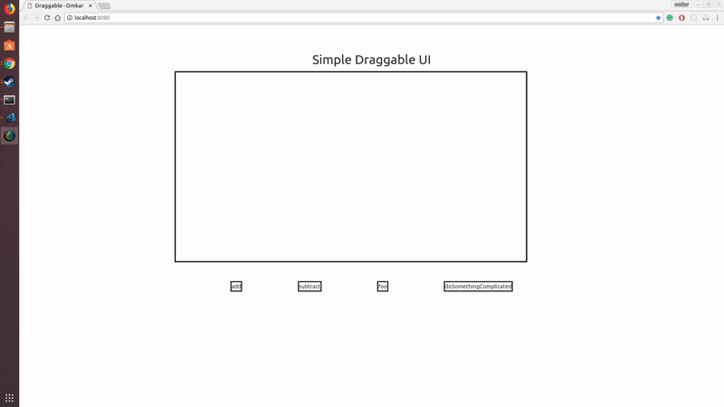

# Introduction

Simple draggable UI to create simple/complex expressions


# Getting Started

1. Clone the repo
   ```
   git clone https://github.com/orkeluskar/draggable-functions.git
   ```

2. Change the directory
   ```
   cd draggable-functions
   ```

3. You can open `index.html` by right clicking and open it in your favorite browser (Chrome)
    OR
    If you have python3 installed
    ```
    python3 -m http.server 8080
    ```
    Then open [localhost:8080](http://localhost:8080)


## Demo

